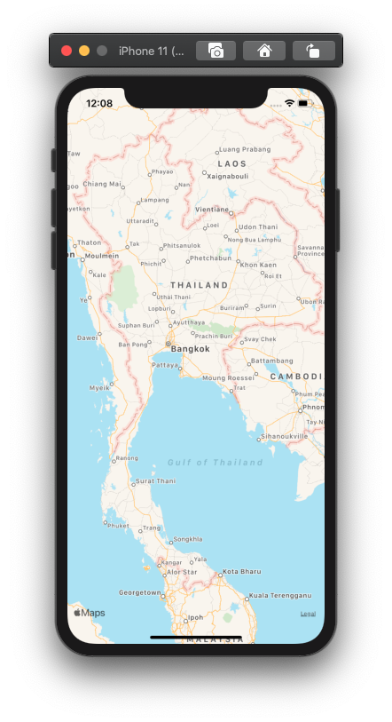
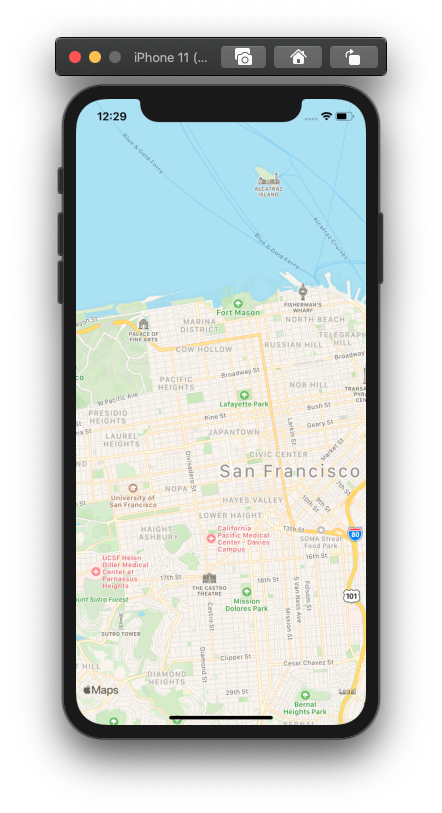
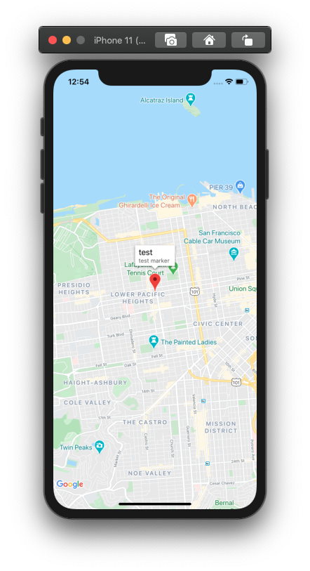
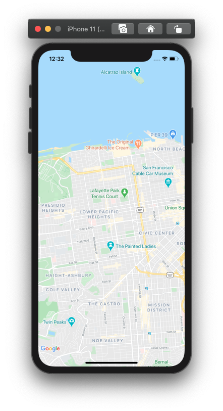

In this tutorial, we will learn how to implement Map in the React Native apps. Maps are used for various purposes in an application. We can use maps as a location tracker, traffic congestion detection, traffic simulation, and many more. Here, we are going to make use of the [react-native-maps package](https://github.com/react-native-community/react-native-maps) in order to implement Map View in our react native application. This package is maintained by the [react native community](https://github.com/react-native-community). The package supports both Android and iOS platforms. We are going to use the components and module from this package to display a map and a marker in this tutorial.

So, let’s get started.

## Installing the React Native Maps Package
First, we need to install the package into our react native project. For that, we need are going to use yarn package manager. In order to install the package, we need to run the following command in our project folder:

```jsx
yarn add react-native-maps
```

## Setup

### **ios**

For iOS setup, we need to use CocoaPods (React Native 0.60 and higher). And then, run the following commands in our project folder:

```jsx
cd ios
pod install
```

**App store submission**

The app's `Info.plist` file must contain a `NSLocationWhenInUseUsageDescription` with a user-facing purpose string explaining clearly and completely why your app needs the location, otherwise Apple will reject your app submission.

**Enabling Google Maps on iOS (React Native all versions)**

If you want to enable Google Maps on iOS, obtain the Google API key and edit your `AppDelegate.m` as follows:

```swift
+ #import <GoogleMaps/GoogleMaps.h>
@implementation AppDelegate
...
- (BOOL)application:(UIApplication *)application didFinishLaunchingWithOptions:(NSDictionary *)launchOptions
{
+ [GMSServices provideAPIKey:@"_YOUR_API_KEY_"]; // add this line using the api key obtained from Google Console
...
```

The `[GMSServices provideAPIKey]` should be the **first call** of the method.

### Android

Ensure your build files match the following requirements:

1. (React Native 0.59 and lower) Define the `react-native-maps` project in `android/settings.gradle`:

```swift
...
include ':react-native-maps'
project(':react-native-maps').projectDir = new File(rootProject.projectDir, '../node_modules/react-native-maps/lib/android')
```

1. (React Native 0.59 and lower) Add the `react-native-maps` as an dependency of your app in `android/app/build.gradle`:

```swift
...
dependencies { ... implementation project(':react-native-maps')
}
```

3.1 (React Native all versions) If you've defined *[project-wide properties](https://developer.android.com/studio/build/gradle-tips.html)* (**recommended**) in your root `build.gradle`, this library will detect the presence of the following properties:

```java
buildscript {...}
allprojects {...}
/** + Project-wide Gradle configuration properties */
ext { compileSdkVersion = xxx targetSdkVersion = xxx buildToolsVersion = "xxx" minSdkVersion = xxx supportLibVersion = "xxx" playServicesVersion = "17.0.0" // or find latest version androidMapsUtilsVersion = "xxx"
}
```

or do

```java
buildscript {
    ext {
        buildToolsVersion = "xxx"
        minSdkVersion = xxx
        compileSdkVersion = xxx
        targetSdkVersion = xxx
        supportLibVersion = "xxx"
        playServicesVersion = "17.0.0" // or find latest version
        androidMapsUtilsVersion = "xxx"
    }
}
...

```

You can find the latest `playServicesVersion` by checking [https://developers.google.com/android/guides/releases](https://developers.google.com/android/guides/releases) and searching for `gms:play-services-maps:`

3.2 (React Native all versions) If you do **not** have *project-wide properties* defined and have a different play-services version than the one included in this library, use the following instead (switch 17.0.0 and/or 17.2.1 for the desired versions):

```java
...
dependencies {
   ...
   implementation(project(':react-native-maps')){
       exclude group: 'com.google.android.gms', module: 'play-services-base'
       exclude group: 'com.google.android.gms', module: 'play-services-maps'
   }
   implementation 'com.google.android.gms:play-services-base:17.2.1'
   implementation 'com.google.android.gms:play-services-maps:17.0.0'
}
```

1. (React Native all versions) Specify your Google Maps API Key:

   Add your API key to your manifest file (`android/app/src/main/AndroidManifest.xml`):

```xml
<application>
   <!-- You will only need to add this meta-data tag, but make sure it's a child of application -->
   <meta-data
     android:name="com.google.android.geo.API_KEY"
     android:value="Your Google maps API Key Here"/>

   <!-- You will also only need to add this uses-library tag -->
   <uses-library android:name="org.apache.http.legacy" android:required="false"/>
</application>
```

> Note: As shown above, com.google.android.geo.API_KEY is the recommended metadata name for the API key. A key with this name can be used to authenticate to multiple Google Maps-based APIs on the Android platform, including the Google Maps Android API. For backwards compatibility, the API also supports the name com.google.android.maps.v2.API_KEY. This legacy name allows authentication to the Android Maps API v2 only. An application can specify only one of the API key metadata names. If both are specified, the API throws an exception.

Source: [https://developers.google.com/maps/documentation/android-api/signup](https://developers.google.com/maps/documentation/android-api/signup)

1. (React Native 0.59 and lower) Add `import com.airbnb.android.react.maps.MapsPackage;` and `new MapsPackage()` in your `MainApplication.java` :

```xml
import com.airbnb.android.react.maps.MapsPackage;
...
    @Override
    protected List<ReactPackage> getPackages() {
        return Arrays.<ReactPackage>asList(
                new MainReactPackage(),
                new MapsPackage()
        );
    }
```

1. (React Native all versions) Ensure that you have Google Play Services installed:

- For the Genymotion emulator, you can follow [these instructions](https://www.genymotion.com/help/desktop/faq/#google-play-services).
- For a physical device you need to search on Google for 'Google Play Services'. There will be a link that takes you to the Play Store and from there you will see a button to update it (do not search within the Play Store).

That's it, you made it! 👍

### Using React Native Maps Package
Here, we are going to start with basic example to display the map in full screen. For that, we need to import MapView component from the react-native-maps package. In order to set the MapView component to the full width and height of the device, we are also going to make use of Dimensions module. Then, we are going to integrate the MapView component with simple styles in the render() function of our component. The overall code is provided in the code snippet below:

```jsx
import React from "react";
import MapView from "react-native-maps";
import { StyleSheet, Text, View, Dimensions } from "react-native";

export default class App extends React.Component {
  render() {
    return (
      <View style={styles.container}>
        <MapView style={styles.mapStyle} />
      </View>
    );
  }
}

const styles = StyleSheet.create({
  container: {
    flex: 1,
    backgroundColor: "#fff",
    alignItems: "center",
    justifyContent: "center",
  },
  mapStyle: {
    width: Dimensions.get("window").width,
    height: Dimensions.get("window").height,
  },
});
```

As a result, we will get following result in our emulator screen:



### Adding Initial Region
The MapView component also enables us to add the region using the initialRegion prop. We can configure the map coordinates like longitude and latitude in the initialRegion prop. This allows us to display particular location in the Map. The MapView configuration using initialRegion is provided below:

```jsx
<MapView
  initialRegion={{
    latitude: 37.78825,
    longitude: -122.4324,
    latitudeDelta: 0.0922,
    longitudeDelta: 0.0421,
  }}
  style={styles.mapStyle}
/>
```

Hence, we will get the following result in the map with the above coordinates:



### Rendering Markers on a map
Here, we are going to add the location marker on the map. It enables us to point the exact location on the map. First, we are going to set the marker state with coordinate values as shown in the code snippet below:

```jsx
state = {
  marker: {
    latitude: 37.78825,
    longitude: -122.4324,
    latitudeDelta: 0.0922,
    longitudeDelta: 0.0421,
  },
};
```

Then, we need to import the Marker component from the react-native-maps package as shown in the code snippet below:
```jsx
import MapView, { PROVIDER_GOOGLE, Marker } from "react-native-maps";
```

Now, we can integrate the Marker component inside the MapView component as shown in the code snippet below:

```jsx
<MapView
  provider={PROVIDER_GOOGLE}
  initialRegion={{
    latitude: 37.78825,
    longitude: -122.4324,
    latitudeDelta: 0.0922,
    longitudeDelta: 0.0421,
  }}
  style={styles.mapStyle}
>
  <Marker
    coordinate={this.state.marker}
    title={"test"}
    description={"test marker"}
  />
</MapView>
```

Here, we move configured the Marker component with coordinate prop which is set to the marker state. Then, we have provided the title and description as well.

As a result, we get the red location marker on the screen with the title as test and description as test marker as shown in the emulator screenshot below:



### Using Google Maps
This is especially for the iOS device in which the maps are set to Apple maps. We can switch to Google maps easily by using PROVIDER_GOOGLE module from the maps package. Then, we can include this to MapView component in the provider prop as shown in the code snippet below:

```jsx
import MapView, { PROVIDER_GOOGLE } from "react-native-maps";
import { StyleSheet, Text, View, Dimensions } from "react-native";

export default class App extends React.Component {
  render() {
    return (
      <View style={styles.container}>
        <MapView
          provider={PROVIDER_GOOGLE}
          initialRegion={{
            latitude: 37.78825,
            longitude: -122.4324,
            latitudeDelta: 0.0922,
            longitudeDelta: 0.0421,
          }}
          style={styles.mapStyle}
        />
      </View>
    );
  }
}
```

Hence, we get the Google map as output as shown in the screenshot below:



### Conclusion

In this tutorial, we learned how to implement the map view in the react native project. We were able to easily implement map view using components and modules from the react-native-maps package. While setting up Map to the full screen was simple, it did not take much effort the add the map coordinates as well. Map Markers are also an important aspect when it comes to dealing with map. Here, we were able to do it easily using the Marker component. Now, the next step can be to add more functionalities using other components and packages out there. We will surely go through them. So, stay tuned!


### Credit

[react-native-community/react-native-maps](https://github.com/react-native-community/react-native-maps/blob/master/docs/installation.md)
