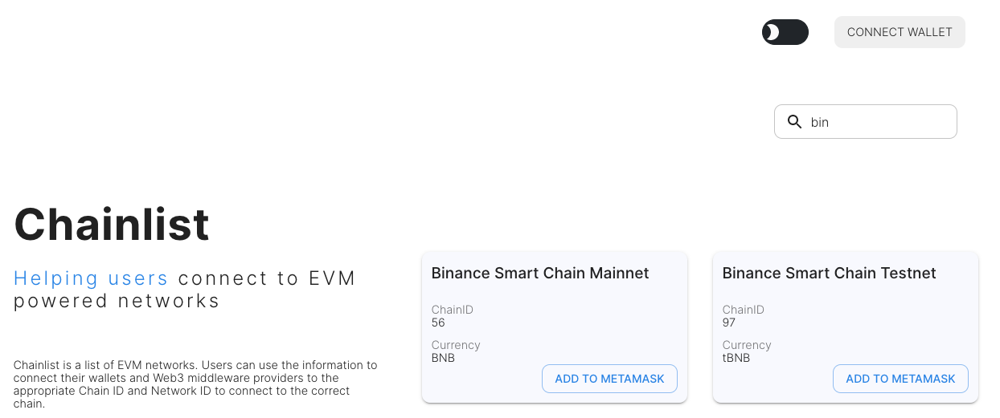

ถ้าเราใช้งาน Metamask กับหลายๆ เชนๆ แล้วความน่่าเบื่อที่สุดคือ ต้องเพิ่มเชนที่เราจะเชื่อมต่อเข้าไปใหม่ 

แล้วถ้าใครไม่รู้ว่าเมต้ามาสมันขยายเต็มจอได้ ก็เปิดๆปิด ค่าเดิมที่ใส่ไว้ก็หาย น่ามคาญมากครับ แต่วันนี้ปัญหาทั้งหมด แก้ได้ผ่านการใช้งาน [Chainlist.org](https://chainlist.org) เพียงคลิกเดียว

