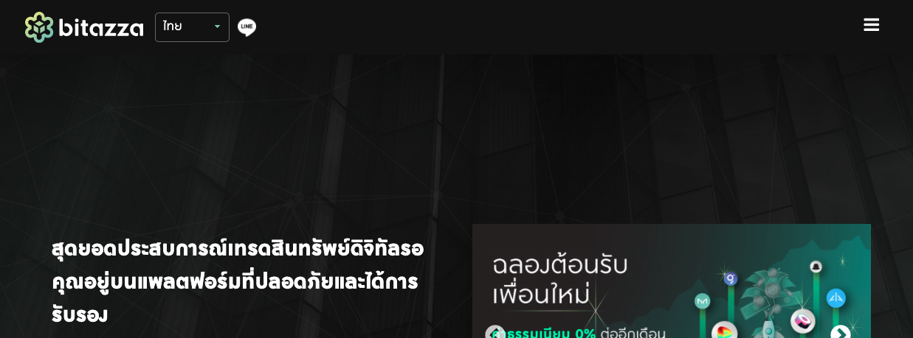

**คำเตือน : ไม่ใช่คำแนะนำทางการเงิน การลงทุนในคริปโตมีความเสี่ยงสูงมาก**

เชื่อว่าท่านที่สนใจในเรื่องคริบโต ต้องเคยได้ยินคำว่าทำฟาร์ม อยู่แล้ว แต่อาจจะไม่เคยทำเองจริงๆ เลย หลายคนถามวิธีการทำมาในเพจ ผมเลยแคบจอมาอธิบายการทำแบบสเตปบายสเตปกันเลยครับ โดยหลักคือผมกะจะลงฟาร์มบน Pancakeswap คู่เหรียญ CAKE กับ BNB โดยจะลงทั้งหมด 1 BNB 

สรุปขั้นตอนทั้งหมด มีดังนี้ครับ

1. ฝากเงินบาทเข้าเอกแชน
2. ซื้อ XRP 
3. โอนไป Binance
4. ขาย XRP เป็น BNB
5. โอน BNB เข้า กระเป๋านอก
6. เปลี่ยน BNB ครึ่งหนึ่งให้เป็น CAKE
7. นำ CAKE กับ BNB เท่าๆ กันไปลง LP 
8. ได้ CAKE/BNB มานำไปฟาร์ม

ว่าแล้วก็ลงดีเทลกันเลยครับ

### ฝากเงินบาทเข้า Exchange

เนื่องจาก ตอนนี้ Bitkub ปิดรับสมัคร แถม Zipmex ก็ KYC ช้า ผมเลยใช้ของ Bitazza ครับ KYC เร็วมากไม่กี่ชั่วโมงได้เลย

ตอนนี้กำลังรันแคมเปญแจกแอดรอบจากการแชร์ อยู่ท่านใดสนใจสมัครได้ที่ลิงค์นี้เลยครับ >>> สมัคร [Bitazza](https://rank.bitazza.com/?kid=1FX3AQ)

.png)

โดยผมจะฝากเข้าไป 10,000 บาท เพื่อไปเป็นค่าธรรมเนียมด้วย

.png)

พอฝากเสร็จก็จะเห็นยอดเข้ามาในหน้าแดชบอร์ดทันทีเลย เร็วมากๆ

.png)

ต่อไปเราจะเอาไปแลกเป็น XRP

.png)

เรียบร้อยละครับ ตอนนี้เสียค่าธรรมเนียมไป 1.4 XRP

.png)

### โอนเป็น XRP ไปไบแนน

ต่อไปเราจะโอน XRP ไป Binance นะครับ ขั้นตอนนี้รอหน่อย ย้ำนะครับ รอประมาณ 10-15 นาที

.png)

ล็อกอินเเข้า Binance ไปเอาเลขกระเป๋ากับ Tag มาก่อนครับ

.png)

จากนั้นเอามาโอนใน Bitazza

.png)

### ขาย XRP เป็น BNB

เมื่อการโอนสำเร็จ เราก็จะเข้าเห็นยอดเข้ามาในบัญชี Binance

.png)

จากนั้นเราจะแปลง XRP เป็น BNB ทันที

.png)

เรียบร้อยละครับ ได้มาพร้อมกับค่าธรรมเนียมเลย

.png)

### ใช้วอลเลทคอนเนคโอน bnb ออกไปกระเป๋า

ต่อไปเราจะโอน BNB ออกไปยังกระเป๋าอีกใบหนึ่งนะครับ ปกติเขาจะใช้ Metamask กันใช่ไหมครับ แต่ Binance ทำกระเป๋าขึ้นมาใช้เลยชื่อ Binance wallet connect ซึ่งข้อดีมันคือเราต่อเข้ากับ Wallet ของ Binance โดยตรงได้เลย

.png)

โดยคลิกเข้าไปในรายชื่อ Asset จะเห็นว่ามันฟีดข้อมูลมาจาก Binance โดยตรงเลย

.png)

เราสามารถเดินเรื่องถอนเงินโดยตรงในกระเป๋าได้เลย

.png)

แต่ก็ต้องยืนยันตามท่ามาตรฐานนะครับ

.png)

ตอนนี้เงินเข้ามาในกระเป๋าผมแล้ว ก่อนหน้านี้มีเศษอยู่บ้าง ยอดจึงบวกขึ้นมานิดหน่อย

.png)

### สแวป BNB ครึ่งหนึ่งเปน CAKE

ต่อไปเราจะลงฟาร์มกันแล้วครับ ขั้นแรกเราจะมาที่ Pancakeswap ก่อน

.png)

เข้าไปที่แทบฟาร์ม  มีมากมายหลากหลายฟาร์มครับแต่ที่เราจะเลือกคือ

.png)

 CAKE-BNB กด Enable เพื่อเปิดฟาร์ม

.png)

ตามท่ามาตรฐานต้อง เชื่อมกับกระเป๋าของเราก่อน

.png)

แล้วไปที่แทบ Swap เราจะแปลง BNB เป็น CAKE

.png)

โดยผมใช้ BNB แลกเป็น CAKE ครึ่งต่อครึ่งเลยครับ จะได้นับง่ายๆ ครั้งนี้ลง มูลค่ารวม 1 BNB

.png)

พอ SWAP เสร็จมันก็จะแจ้งขึ้นมาบอกแบบนี้

.png)

### นำ CAKE และ BNB มาใส Liquidity Pool

ยังไม่เสร็จนะครับต่อไป เราจะเอาคู่เหรียญไปเพิ่มใน LP ( Liquidty Pool ) 

.png)

ตอนนี้มูลค่าที่เพิ่มเข้าไปต้องใส่ให้เท่าๆ กันครับ

.png)

กด Supply มันจะสรุปทั้งหมดแล้วให้เราคอนเฟิร์ม

.png)

มาละครับขั้นตอนนี้จะเสียค่า fees 0.0024 BNB

.png)

เรียบร้อยไปอีกหนึ่งสเตปเราจะได้เหรียญ CAKE/BNB จำนวน 2.046 BNB เป็นเสมือนใบหุ้น

.png)

### ได้ CAKE-BNB LP ไปฟาร์ม

ขั้นสุดท้ายเราจะนำ CAKE/BNB ไปลงฟาร์มกัน กลับไปที่หน้าฟาร์ม กด Stake LP 

.png)

โดยขั้นตอนนี้จะเสียค่าธรรมเนียมอีก 0.002 BNB

.png)

เรียบร้อยละครับตอนนี้เราจะเห็นดอกเบี้ยวิ่งกันเป็นรายวินาทีกันเลย ถ้าเราลงเยอะพอ

.png)

ยังไม่จบนะครับ ตอนหน้าเราจะ เพิ่มดีกรีความโลภโดยการ Harvest หรือเก็บเกี่ยวดอกเบี้ยของเรา เพื่อเอาไปลง Syrup Pool กัน เพื่อเก็บดอกเบี้ยอีกต่อหนึ่ง